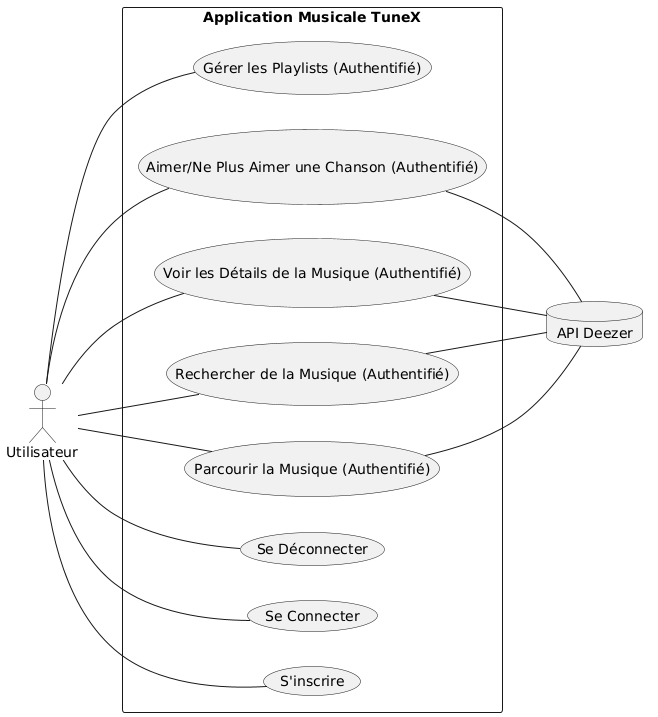
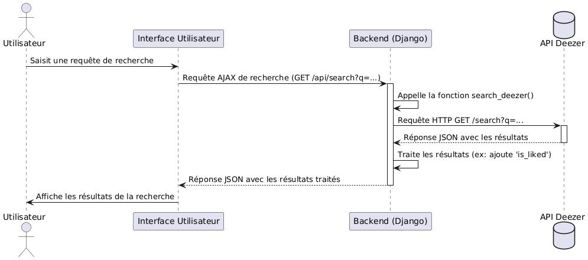
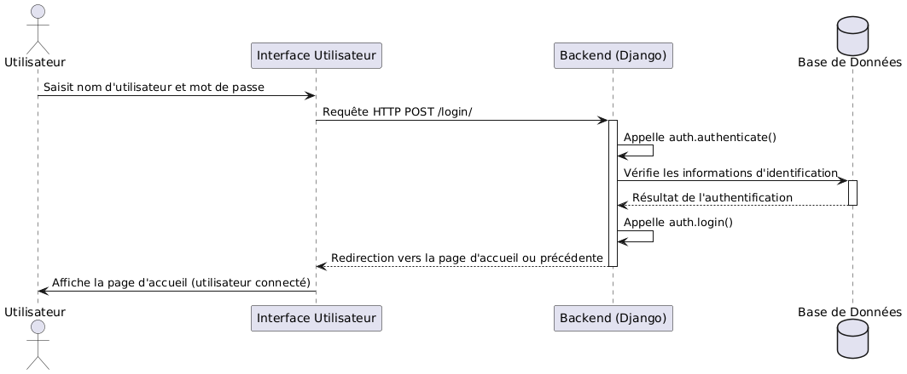
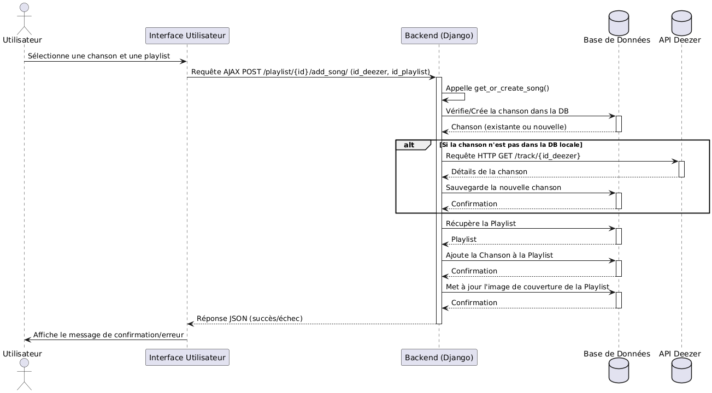

# TuneX - Clone de Spotify (Projet de Classe)

**Cours :** EMSI 3IIR20 - Projet de Classe  
**Projet :** TuneX - Une application web de streaming musical de type Spotify.

## Sommaire

1.  [Introduction](#introduction)
2.  [Méthodologie Adoptée](#méthodologie-adoptée)
3.  [Modélisation UML](#modélisation-uml)
4.  [Fonctionnalités](#fonctionnalités)
5.  [Technologies Utilisées](#technologies-utilisées)
6.  [Structure du Projet](#structure-du-projet)
7.  [Installation](#installation)
8.  [Utilisation](#utilisation)
9.  [Améliorations Futures](#améliorations-futures)
10. [Contributeurs](#contributeurs)

## Introduction

TuneX est une application web développée pour le cours EMSI 3IIR20, simulant les fonctionnalités de base de services comme Spotify. Elle permet la recherche de musique, l'écoute d'extraits, la gestion des favoris et la création de playlists personnelles, en utilisant l'API Deezer. Ce projet met en œuvre les principes du développement web avec Django (backend) et HTML, CSS, JavaScript (frontend).

## Méthodologie Adoptée

*Modèle en Cascade*

- Spécification des besoins  
- Conception UML  
- Développement  
- Tests  
- Déploiement  

## Modélisation UML

### Diagramme de cas d’utilisation  


### Diagramme de classes  


### Diagrammes de Séquence

#### Séquence : Rechercher de la Musique


#### Séquence : Se Connecter


#### Séquence : Ajouter une Chanson à une Playlist


## Fonctionnalités

* **Authentification :** Inscription et connexion sécurisées.
* **Découverte Musicale :**
    * Accueil : Top titres, artistes, playlists Deezer.
    * Recherche : Morceaux, artistes, albums (avec résultats en direct et priorisation d'artistes).
    * Profils d'Artistes : Détails et top titres.
    * Détails Playlists Deezer.
    * Nouveautés : Albums récents.
* **Lecture Audio :**
    * Lecteur intégré pour extraits (Deezer).
    * Contrôles : Play/Pause, Suivant/Précédent, Aléatoire, Répétition.
    * Contrôle du volume et barre de progression.
    * Récupération dynamique des URL d'aperçu pour éviter les liens expirés.
* **Personnalisation :**
    * Titres Aimés : Aimer/Ne plus aimer des morceaux, page dédiée.
    * Playlists Utilisateur : Création, ajout/suppression de morceaux, gestion, pochettes dynamiques.
* **Interface Utilisateur :**
    * Design responsive avec sidebar et zone de contenu.
    * Chargement dynamique via JavaScript et AJAX.
    * Notifications pour les actions utilisateur.

## Technologies Utilisées

* **Backend :** Django (Python), **MySQL** (Base de données), `requests` pour l'API Deezer.
* **Frontend :** DTL (Django Template Language), CSS, JavaScript (Vanilla JS, Fetch API).
* **Version Control :** Git & GitHub.
* **API Externe :** API Deezer.

## Installation

1.  **Cloner le dépôt (si sur GitHub) :**
    ```bash
    git clone [https://github.com/votre-utilisateur/TuneX-Django-App.git](https://github.com/votre-utilisateur/TuneX-Django-App.git)
    cd TuneX-Django-App
    ```
2.  **Créer et activer un environnement virtuel :**
    ```bash
    python -m venv venv
    # Windows: venv\Scripts\activate
    # macOS/Linux: source venv/bin/activate
    ```
3.  **Installer les dépendances (via `requirements.txt` à créer) :**
    ```bash
    pip install -r requirements.txt 
    ```
    *(Dépendances clés : `Django`, `requests`, `mysqlclient` ou `PyMySQL`)*
4.  **Configurer la base de données MySQL** dans `TuneX/settings.py`.
5.  **Appliquer les migrations :**
    ```bash
    python manage.py makemigrations music
    python manage.py migrate
    ```
6.  **Créer un superutilisateur (admin) :**
    ```bash
    python manage.py createsuperuser
    ```
7.  **Lancer le serveur de développement :**
    ```bash
    python manage.py runserver
    ```
    Accéder via `http://127.0.0.1:8000/`.

## Utilisation

* Ouvrir `http://127.0.0.1:8000/`.
* S'inscrire ou se connecter.
* Explorer, rechercher, écouter des extraits.
* Aimer des titres, créer/gérer des playlists.

## Améliorations Futures

* Lecture complète des morceaux (nécessite intégration SDK type Spotify).
* Pages de détails pour les albums.
* Fonctionnalités sociales.
* Gestion avancée des playlists.
* Personnalisation du profil utilisateur.
* Lecture de podcasts.
* Recommandations améliorées.

## Contributeurs

* Benouari Badr-Eddine
* IBNOUCHEIKH Ilyass
